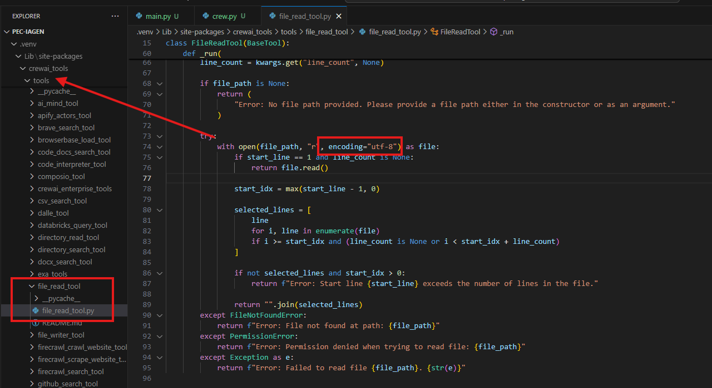

<div style="max-width: 800px; margin: auto;">

# PEC: IA GENERATIVA

## Enunciado del problema

Se quiere hacer un sistema que dado un libro de un autor dado lo lea y cree al menos tres recetas de cocina que tengan que ver con el contenido del libro. Las recetas deben ser aptas para 
los humanos y realizables.

Para resolver este problema se requiere:

1. Sistema de agentes que solucione el problema

2. Evaluación del sistema, dando métricas de rendimiento. Se puede traer los platos para su degustación.

3. Una justificación clara de que la receta y el contenido del libro están relacionados.

## A tener en cuenta

### Versión de Pythoh
He usado la versión 3.11.0 de Python.

### API KEY y Modelo
Crear un archivo con nombre .env en la raíz del proyecto con la API_KEY y los modelos a usar durante la ejecución.
```python
# pec-iagen/.env
# OpenAI API Key
OPENAI_API_KEY="API_KEY"
MODEL_GPT3="gpt-3.5-turbo"
MODEL_GPT4="gpt-4-turbo"
```

He tenido problemas con la herramienta ReadFileTool de CrewAI, me estaba dando error de enconding todo el rato pese a estar grabando los libros en encondig=”utf-8” que es la que usa por 
defecto la librería open. Para solucionarlo he tenido que modificar la librería de CrewAI.



## Proceso

### Gestor de libros

Defino una clase para manejar la descarga y carga de libros desde la API Project Gutenberg en el archivo _manage_books.py_. De forma aleatoria se descargan libros y defino un método para poder cargar el contenido de 
los libros.

De cara a la PEC, simplemente cargo un libro al azar de todos los descargados para ejecutar la secuencia de agentes y crear las tres recetas por libro. Dejo en el repositorio descargados 10 libros y
3 artículos(con 3 recetas cada uno) de salida del sistema de agentes a modo de muestra y justifiación del trabajo.

<pre>
├── knowledge
│   ├── articles
│   ├── books
</pre>

### Afrontar problema

Tras pensar en cómo resolver el problema planteado, opto por usar un sistema de agentes para obtener las recetas del libro usando el Framework CrewAI. Aplicando las buenas prácticas de
la documentación de CrewAI, que consiste en usar archivos yaml para definir los agentes y las tareas. Podría haber optado por otros enfoques, a continuación, enuncio los principales 
pros y contras de esta elección.
* Pros
    * Facilidad y rapidez de implementación.
    * Fortaleza del know-how. Al usar el framework, teóricamente, aprovechas las soluciones optimizadas que usan en la librería por expertos en la materia. Por ejemplo, tratar de asegurar que 
    la salida siempre sea con la estructura definida durante la implementación.
    * Escalabilidad. Una vez montando el sistema de agentes es mucho más fácil y rápido incluir nuevos agentes para nuevas tareas.
    * Control de errores. El framework ya tiene implementada una correcta gestión de posibles errores durante el proceso de ejecución.

* Contras
    * Requiere conocimientos del framework. Pese a ser muy intuitivo, también requiere un nivel de conocimiento del framework y en general de lidiar con documentación y repositorio de código.
    * Menor control. Al tener un mayor grado de abstracción, hay opciones que no están disponibles en CrewAI que se podrían implementar si se usan librerías como langchai o las propias de los LLM.
    * Mayor dificultad de debugging. El flujo distribuido entre agentes hace más complejo rastrear errores y/o compartamientos no deseados.

La idea es usar las siguientes técnicas para tratar de mejorar los resultados obtenidos.
* **Decomposend Prompting (DECOMP)**: Dividiendo el problema en tareas concretas que serán resueltas por cada uno de los agentes.
* **Self-Criticism**: Evaluar las respuestas obtenidas por el modelo con un agente encargado de esta tarea.
* **Structured Output**: Con la ayuda de la librería pydantic defino clases para conseguir una salida homogénea y estructurada.
* **Chunking**: Con la ayuda de la librería crewai_tools uso funciones que fragmentan el contenido de los libros para no exceder el tamaño máximo de tokens y evitar la pérdida de contexto.

En base a esta estrategia, defino los siguientes agentes-tareas:

1. Buscador de ingredientes:
La idea es detectar potenciales ingredientes dentro del texto. Lo enfoco a localizarlos de una forma directa, cuando el ingrediente realmente está escrito dentro del texto, o de forma 
indirecta, cuando el ingrediente podría obtenerse por contexto: cultural, entorno, historia...

El objetivo es conseguir un amplio listado de potenciales ingredientes y la justificación por cada uno de ellos de su relación con el libro.

2. Comprobador de ingredientes:
De cara a confirmar qué la detección de ingredientes ha sido correcta, el listado es comprobado por este agente. El cuál conserva todos los ingredientes que compruebe que sean potencialmente interesantes para las recetas.

3. Experto cocinero:
Este agente será el encargado de elaborar 5 recetas con los ingredientes seleccionados dentro del contexto del libro. No será necesario que se usen todos, pero sí que la mayoría de los 
ingredientes deben de estar dentro de esta lista.

4. Jurado:
El agente deberá ranquear las recetas por su sabor y originalidad, y quedarse con las 3 mejores recetas de cocina. Con esto se minimiza aún más la probabilidad de que acabe dándose como 
salida una receta que no sea comestible.

5. Escritor:
Se finaliza la secuencia con una salida en markdown con las 3 recetas del libro y una breve justificación de la relación entre la receta y el libro.

Por la índole del problema y la solución planteada, la ejecución de los agentes será de una forma Secuencial. Puesto que es necesario que acabe cada agente y pase su respuesta al 
siguiente.

### Modelo usado

Durante todo el proceso de pruebas he usado el modelo “gpt-3.5-turbo” de openai, una vez asegurado el código he probado varias ejecuciones con el modelo “gpt-4-turbo" de mayor tamaño, de 
cara a mejorar los resultados finales.

## Conclusión

En la mayoría de los casos, se consiguen resultados aparentemente buenos. La salida arroja recetas comestibles, realizables y justificadas con criterio.

Dicho lo cual, se plantean diferentes puntos que se deberían de afrontar.
* **Fiabilidad de la justificación**. Se debería de establecer un mecanismo, supervisado o no supervisado, que garantice que el modelo no esté alucinando al relacionar la receta con el libro.
* **Gestión librería crewai**. Puntualmente la librería no es capaz de garantizar el proceso de ejecución. Por ejemplo, con cierta frecuencia se excede el número máximo de tokens provocando la 
pérdida de información durante el proceso.
* **Método de evaluación**. Lo más complejo al abordar este tipo de problemas con LLMs, junto con el comportamiento probabilista, es conseguir un método de evaluación que no solo garantice la 
calidad de los resultados; si no ser capaz de evaluar resultados comparando varios planteamientos y confirmar que seleccionamos el mejor de forma cuantitativa.

</div>
